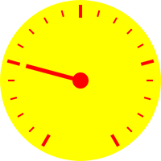

# Comentsys.Toolkit.Blazor

**Comentsys.Toolkit.Blazor** is a **Toolkit** with **Components** for **Blazor Server** and / or **Blazor WebAssembly** using **.NET 8** or **.NET 9** plus useful **Extensions** using **Comentsys.Toolkit** along with **Comentsys.Assets.Display**.

## Change Log

### Version 1.0.0

- Initial Release

## Asset

`Asset` Component for **Blazor WebAssembly** and **Blazor Server** which can be used to represent an `AssetResource` in a **Blazor** application.

### Example


> Example using `AssetResource` from `ShadedFluentEmoji.Get(FluentEmojiType.GrinningFace)` in **Package** of `Comentsys.Assets.FluentEmoji.Shaded`.

### AssetResource

Asset Resource of Asset

### Height

Asset Resource Height

### Mode

Asset Mode of Asset Resource as Image Tag with Base 64 Encoded SVG or Inline SVG

### Title

Title Text of Asset

### UseAssetResourceHeight

Use Asset Resource Height if Height not specified

### UseAssetResourceWidth

Use Asset Resource Width if Width not specified

### Width

Asset Resource Width

## AssetMode

Asset Mode of Asset Component

### Image

Asset Resource as Image Tag with Base 64 Encoded SVG

### Inline

Asset Resource as Inline SVG

## Clock

`Clock` Component for **Blazor WebAssembly** or **Blazor Server** with `IsRealTimeForWebAssembly` is `false` which can be used to display an analogue **Clock** in a **Blazor** application and can customise the colours used.


### Example

### Background

Background Colour of Clock

### Fill

Fill Colour of Clock

### Foreground

Foreground Colour of Clock Markers

### HandsFill

Fill Colours of Clock Hands in order: Hour, Minute, Second

### IsRealTimeForWebAssembly

Is Real Time for Blazor WebAssembly?

### ShowHourHand

Show Hour Hand on Clock?

### ShowMinuteHand

Show Minute Hand on Clock?

### ShowSecondHand

Show Second Hand on Clock?

### Size

Size of Clock

### Stroke

Stroke Colour of Clock

### TimeSource

Time Source of Clock

### Title

Title Text of Clock

## Dial

`Dial` Component for **Blazor WebAssembly** can be used to select a `Value` between a `Minimum` and `Maximum` value and can customise the colours used.

### Example


### Fill

Fill Colour of Dial

### Foreground

Foreground Colour of Dial

### Knob

Width of Knob of Dial

### Maximum

Maximum Value of Dial

### Minimum

Minimum Value of Dial

### Size

Size of Dial

### Title

Title Text of Dial

### Value

Value of Dial

### ValueChanged

Event Triggered when Dial Value changed

## DirectionalPad

`DirectionalPad` Component for **Blazor WebAssembly** can be used for selecting a **Direction** of `Up`, `Down`, `Left` and `Right` and can customise the colours used.

### Example


### DirectionChanged

Event Triggered when Directional Pad Direction Changed

### DirectionsFill

Fill Colours of Directional Pad in clockwise order: Up, Right, Down, Left

### Fill

Fill Colour of Directional Pad

### RepeatOnHold

Indicates DirectionChanged should fire repeatedly when Directional Pad direction is held

### Size

Size of Directional Pad

### Title

Title Text of Directional Pad

## DirectionalPadDirection

Direction of Directional Pad Component

### Down

Down Pad Direction

### Left

Left Pad Direction

### Right

Right Pad Direction

### Up

Up Pad Direction

## DirectionalStick

`DirectionalStick` Component for **Blazor WebAssembly** can be used to select an `Angle` around the centre and `Ratio` between the centre and the outer edge along with being able to customise the colours used.

### Example


### Fill

Fill Colour of Directional Stick

### Foreground

Foreground Colour of Directional Stick Knob

### Sensitivity

Sensitivity of Directional Stick

### Size

Size of Directional Stick

### Title

Title Text of Directional Stick

### ValueChanged

Event Triggered when Directional Stick Value Changed

## DirectionalStickValue

Value of Directional Stick Component

| Name | Description |
| ---- | ----------- |
| angle | *Unknown type*<br>Stick Angle around Centre |
| ratio | *Unknown type*<br>Stick Ratio from Centre |

### Constructor(angle, ratio)

Directional Stick Value

| Name | Description |
| ---- | ----------- |
| angle | *System.Double*<br>Stick Angle around Centre |
| ratio | *System.Double*<br>Stick Ratio from Centre |

### Angle

Stick Angle around Centre

### Ratio

Stick Ratio from Centre

## Donut

`Donut` Component for **Blazor WebAssembly** and **Blazor Server** which can be used to display a set of values in a donut-chart with a `Hole` or pie chart without one along with being able to customise the colours used.

### Example


### Hole

Size of Donut Hole

### Items

Donut Items

### SectorsFill

Fill Colours of Donut Sectors in clockwise order

### Size

Size of Donut

### Stroke

Stroke Colour of Donut Sectors

### StrokeWidth

Stroke Width of Donut Sectors

### Title

Title Text of Donut

## Gauge

`Gauge` Component for **Blazor WebAssembly** and **Blazor Server** to indicate a `Value` between a `Minimum` and `Maximum` value along with being able to customise the colours used.

### Example



### Fill

Fill Colour of Gauge

### Foreground

Foreground Colour of Gauge

### Maximum

Maximum Value of Gauge (Less Than or Equal to 100)

### Minimum

Minimum Value of Gauge (Greater Than or Equal to 0)

### Needle

Width of Needle of Gauge

### Size

Size of Gauge

### Title

Title Text of Gauge

### Value

Value of Gauge

## SegmentDisplay

`SegmentDisplay` Component for **Blazor WebAssembly** or **Blazor Server** with `IsRealTimeForWebAssembly` as `false` which can be used for a seven-segment based **Display** in a **Blazor** application and can customise the colours used.

## Example


### DateFormat

Date Format of Display if using Display Mode of Date

### DateTimeSource

Date Time Source of Display if using Display Mode of Time, Date or TimeDate

### DisplayFill

Fill colours of the Display in order from left to right

### Fill

Fill colour of the Display

### Height

Display Height

### IsRealTimeForWebAssembly

Is Real Time for Blazor WebAssembly if using Display Mode of Time, Date or TimeDate

### Mode

Display Mode of Time, Date, TimeDate or 

### Title

Title Text of Display

### TimeDateFormat

Time and Date Format of Display if using Display Mode of TimeDate

### TimeFormat

Time Format of Display if using Display Mode of Time

### Value

Value of the Display if using Display Mode of Value

### Width

Display Width

## MatrixDisplay

`MatrixDisplay` Component for **Blazor WebAssembly** or **Blazor Server** with `IsRealTimeForWebAssembly` as `false` which can be used for a five-by-seven dot-matrix based **Display** in a **Blazor** application and can customise the colours used.

### Example


### DateFormat

Date Format of Display if using Display Mode of Date

### DateTimeSource

Date Time Source of Display if using Display Mode of Time, Date or TimeDate

### DisplayFill

Fill colours of the Display in order from left to right

### Fill

Fill colour of the Display

### Height

Display Height

### IsRealTimeForWebAssembly

Is Real Time for Blazor WebAssembly if using Display Mode of Time, Date or TimeDate

### Mode

Display Mode of Time, Date, TimeDate or Value

### Style

Display Style

### Title

Title Text of Display

### TimeDateFormat

Time and Date Format of Display if using Display Mode of TimeDate

### TimeFormat

Time Format of Display if using Display Mode of Time

### Value

Value of the Display if using Display Mode of Value

### Width

Display Width

## DisplayMode

Display Mode of `SegmentDisplay` or `MatrixDisplay`

### Date

Display Date as Date Format of dd-MM-yyyy by Default

### Time

Display Time as Time Format of HH:mm:ss by Default

### TimeDate

Display Time and Date as Time Date Format of HH:mm:ss dd-MM-yyyy by Default

### Value

Display any Value containing 0 - 9, Dash, Colon and Space also used for unsupported characters

## Sector

`Sector` Component for **Blazor WebAssembly** and **Blazor Server** can be used to represent a portion or **Arc** section of a **Circle** as needed where the `Start` and `Finish` position of the `Sector` can be set along with the `Hole` which allows for a variety of combinations for display along with being able to customise the colours used.

### Example


### Fill

Fill Colour of Sector

### Finish

Finish Angle of Sector

### Hole

Size of Sector Hole

### Size

Size of Sector

### Start

Start Angle of Sector

### Stroke

Stroke Colour of Sector

### StrokeWidth

Stroke Width of Sector

### Title

Title Text of Sector

## Extensions

`Comentsys.Toolkit.Blazor` contains some useful **Methods** such as getting the **Data Uri** of an `AssetResource` or `ImageResource` along with converting a `System.Drawing.Color` to a **HTML** colour.

### AsDataUri(assetResource)

As Data Uri

| Name | Description |
| ---- | ----------- |
| assetResource | *Comentsys.Toolkit.AssetResource*<br>Asset Resource |

#### Returns

Data Uri

### AsDataUri(imageResource)

As Data Uri

| Name | Description |
| ---- | ----------- |
| imageResource | *Comentsys.Toolkit.ImageResource*<br>Image Resource |

#### Returns

Data Uri

### AsHtmlColor(color)

As HTML Colour

| Name | Description |
| ---- | ----------- |
| color | *System.Drawing.Color*<br>Drawing Color |

#### Returns

HTML Colour String

### AsHtmlColor(color)

As HTML Colour

| Name | Description |
| ---- | ----------- |
| color | *System.Nullable{System.Drawing.Color}*<br>Drawing Color |

#### Returns

HTML Colour String

## Licence

```
MIT License

Copyright (c) Comentsys

Permission is hereby granted, free of charge, to any person obtaining a copy
of this software and associated documentation files (the "Software"), to deal
in the Software without restriction, including without limitation the rights
to use, copy, modify, merge, publish, distribute, sublicense, and/or sell
copies of the Software, and to permit persons to whom the Software is
furnished to do so, subject to the following conditions:

The above copyright notice and this permission notice shall be included in all
copies or substantial portions of the Software.

THE SOFTWARE IS PROVIDED "AS IS", WITHOUT WARRANTY OF ANY KIND, EXPRESS OR
IMPLIED, INCLUDING BUT NOT LIMITED TO THE WARRANTIES OF MERCHANTABILITY,
FITNESS FOR A PARTICULAR PURPOSE AND NONINFRINGEMENT. IN NO EVENT SHALL THE
AUTHORS OR COPYRIGHT HOLDERS BE LIABLE FOR ANY CLAIM, DAMAGES OR OTHER
LIABILITY, WHETHER IN AN ACTION OF CONTRACT, TORT OR OTHERWISE, ARISING FROM,
OUT OF OR IN CONNECTION WITH THE SOFTWARE OR THE USE OR OTHER DEALINGS IN THE
SOFTWARE.
```